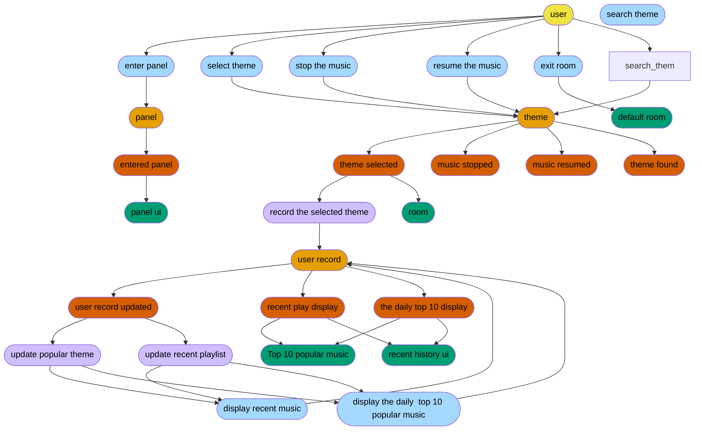

# Phase 1
## Panel
User open the theme panel\
User select the theme\
User stop the music\
User leave the theme\
User search the theme\
User can know the current popular theme
## Recent Play
User can enter the recent play list
## Daily popular
User can see the daily popular in their location
# Phase 2 
## Auth
User log in or sign up\
User enter the default room
# Phase 3 
## AI recommendation 
1. Global AI model will recommend based on the user play list
2. Global AI model will recommend based on the user description 
3. Global AI model will recommend based on the local weather 